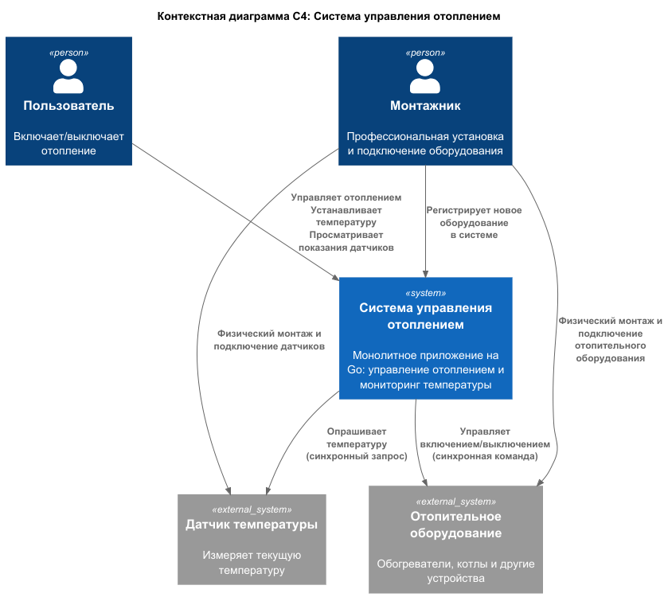
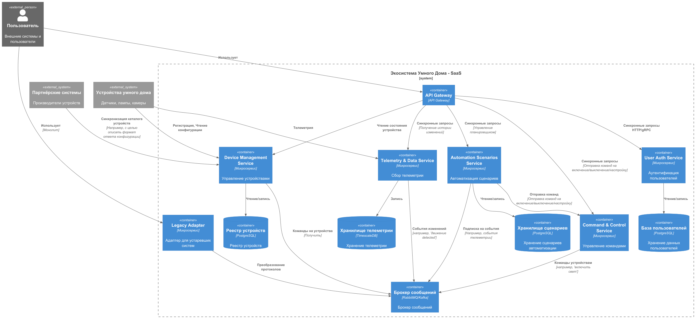
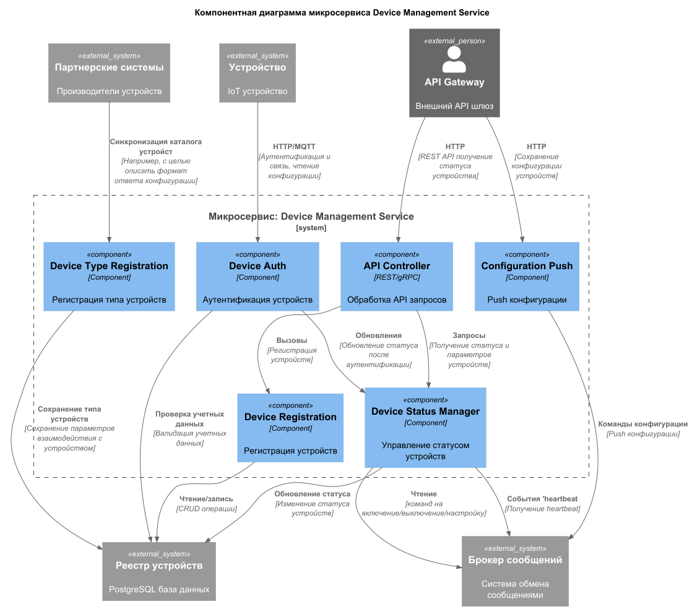
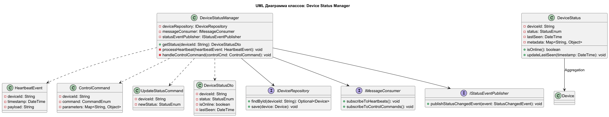
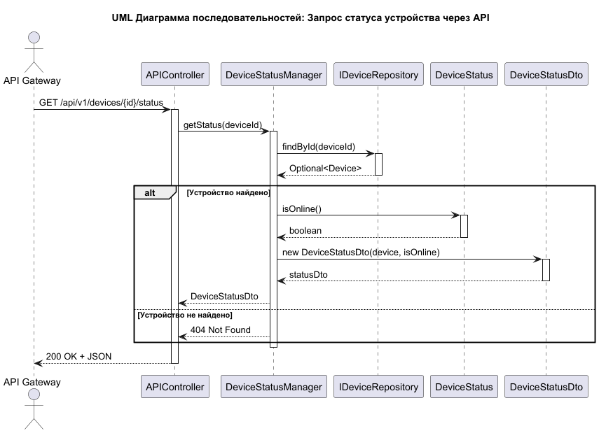
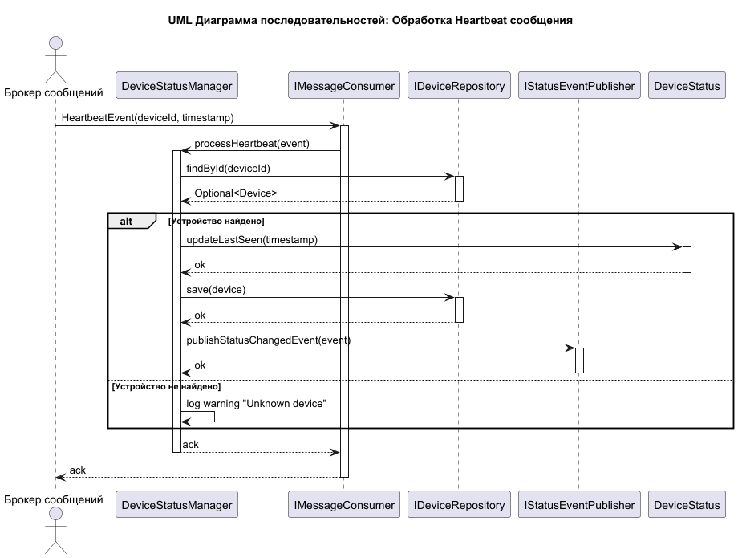
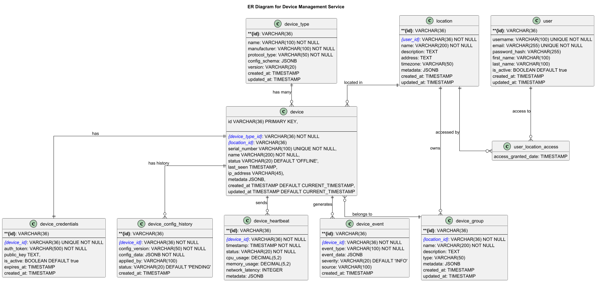

# Project_template

Это шаблон для решения проектной работы. Структура этого файла повторяет структуру заданий. Заполняйте его по мере работы над решением.

# Задание 1. Анализ и планирование

### 1. Описание функциональности монолитного приложения

## Управление отоплением

**Пользователи могут:**
- Включать и выключать систему отопления через веб-интерфейс или мобильное приложение
- Устанавливать желаемую температуру для каждого подключенного датчика

**Система поддерживает:**
- Прямое управление отопительными приборами
- Синхронную передачу команд управления от сервера к устройствам
- Хранение информации о датчиках PostgreSQL
- Централизованное управление всеми подключенными устройствами

## Мониторинг температуры
**Пользователи могут:**
- Просматривать текущую температуру с датчиков

**Система поддерживает:**
- Синхронный опрос датчиков температуры по запросу от сервера
- Хранение температурных данных в базе данных PostgreSQL

### 2. Анализ архитектуры монолитного приложения

- **Монолитная структура**: все функции реализованы в едином приложении на Go
- **Синхронная коммуникация**: прямое управление устройствами без асинхронных вызовов
- **Централизованное управление**: сервер инициирует все взаимодействия с устройствами
- **Профессиональная установка**: требуется выезд специалиста для подключения оборудования
- **Отсутствие самообслуживания**: пользователи не могут самостоятельно подключать устройства

### 3. Определение доменов и границы контекстов

## Домен управления температурой
### Поддомен управления оборудованием
- **Контекст управления состоянием оборудования**
  - Включение/выключение отопительного оборудования

### Поддомен мониторинга показателей 
- **Контекст сбора данных с датчиков**
  - Запрос текущих значений температуры

## Домен подключения оборудования
### Поддомен управления системой отопления (Heating System Management Subdomain)
- **Контекст установки оборудования**
  - Физический монтаж отопительного оборудования
  - Подключение к системе энергоснабжения
  - Настройка базовых параметров

- **Контекст регистрации оборудования в системе**
  - Добавление нового оборудования в базу данных

### **4. Проблемы монолитного решения**

# Основные проблемы монолитного приложения для управления отоплением

### 1. Отсутствие масштабируемости
- Вертикальное масштабирование - единственный вариант, что ограничивает рост системы
- Невозможно масштабировать отдельные компоненты системы независимо
- Все пользователи используют один экземпляр приложения, создавая единую точку нагрузки

### 2. Жёсткая связность компонентов
- Управление отоплением и мониторинг температуры тесно связаны
- Изменения в одном модуле могут непредсказуемо повлиять на другие
- Сложность внедрения новых функций без переписывания всей системы

### 3. Синхронная архитектура
- Блокирующие операции - запросы к датчикам блокируют выполнение других задач
- Низкая отзывчивость при высокой нагрузке
- Проблемы с доступностью - если один датчик недоступен, это может повлиять на всю систему

### 4. Отсутствие отказоустойчивости
- Единая точка отказа - падение монолита означает полную неработоспособность системы
- Нет изоляции сбоев - проблемы с одним датчиком могут повлиять на работу всей системы

### 5. Ограниченная функциональность
- Только базовое управление отоплением и мониторинг температуры
- Невозможность самостоятельного подключения устройств пользователями
- Отсутствие персонализации и расширенных сценариев использования

### 6. Зависимость от выезда специалистов
- Высокие операционные затраты на подключение каждого нового клиента
- Длительное время подключения новых пользователей
- Невозможность быстрого масштабирования бизнеса

### 7. Замедление разработки
- Сложность внедрения новых функций из-за взаимозависимостей
- Длительные циклы тестирования и выпуска обновлений
- Риск регрессионных ошибок при любых изменениях

### 8. Технический долг
- Накопление сложности с ростом кодовой базы
- Сложность найма разработчиков, готовых работать с устаревшей архитектурой
- Высокие затраты на поддержку и развитие

### 9. Закрытая экосистема
- Отсутствие API для интеграции со сторонними системами
- Невозможность подключения устройств разных производителей
- Ограниченные возможности для партнёрств и расширения функциональности

### 10. Проблемы с производительностью
- Единая база данных становится узким местом
- Нет возможности оптимизировать отдельные компоненты под специфические нагрузки
- Сложности с кэшированием и оптимизацией запросов

Если вы считаете, что текущее решение не вызывает проблем, аргументируйте свою позицию.

### 5. Визуализация контекста системы — диаграмма С4

# Задание 2. Проектирование микросервисной архитектуры

**Диаграмма контейнеров (Containers)**

**Диаграмма компонентов (Components)**

**Диаграмма кода (Code)**

# Задание 3. Разработка ER-диаграммы
Ниже представлен пример ER диаграммы для Контейнера "Device Management Service"

# Задание 4. Создание и документирование API

### 1. Тип API

Для чтения состояния устройств используются Синхронные REST API
Решение обусловлено простотой использования подобных API и отсутствием необходимости опрашивать устройства, 
т.к. их состояние обновляется в результате работы подсистемы hearbeat когда каждое устройство информирует о своем состоянии систему.

Обновление состояния осуществляется асинхронным образом, путем принятия управляющих команд от компонента Configuration Push,
сохранения команд в очереди брокера сообщений и обработкой их компонентом "Device Status Manager"

### 2. Документация API
В качестве примера приведена документация выгруженная из swagger
[Документация нашего API](./apps/devicemanagement/api-docs/openapi.json)

# Задание 5. Работа с docker и docker-compose
Реализованы самые минимальные примеры взаимодействия
сборка приложения и запуск осуществляется из корня проекта
mvn clean package
Запуск docker compose осуществляется командой

docker compose -f compose.yaml -f ./apps/devicemanagement/compose.yaml -f ./apps/LegacyAdapter/compose.yaml up --build

# **Задание 6. Разработка MVP**

Не предполагается использовать ту же саму базу в силу того, что существенно расширяется функционал
Предлагается смаршрутизировать запросы на новый API с существующей сигнатурой вызова
который будет управляющие команды отправлять в Rubbit MQ а команды на чтение адресовать к соответсвующему сервису
### **Что нужно сделать**
Сервисы написаны исключительно в виде примера.
docker compose -f compose.yaml -f ./apps/devicemanagement/compose.yaml -f ./apps/LegacyAdapter/compose.yaml up --build
В результате у вас должны быть созданы Dockerfiles и docker-compose для запуска микросервисов. 